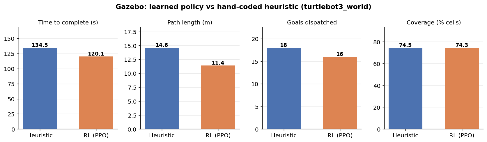
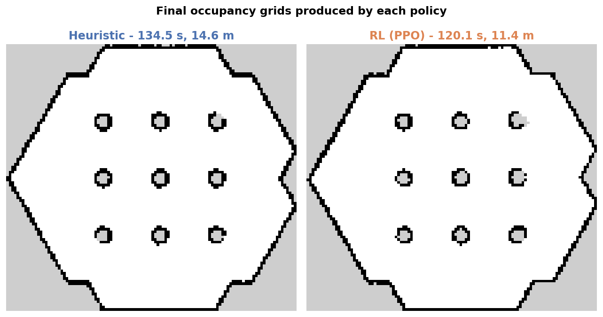
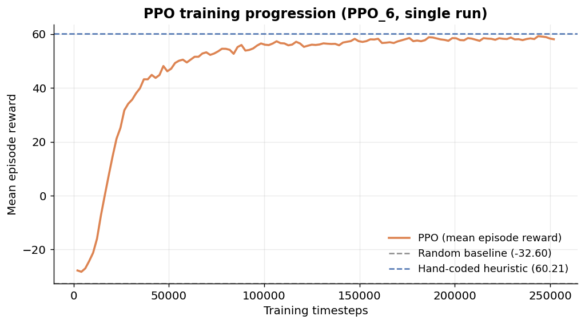
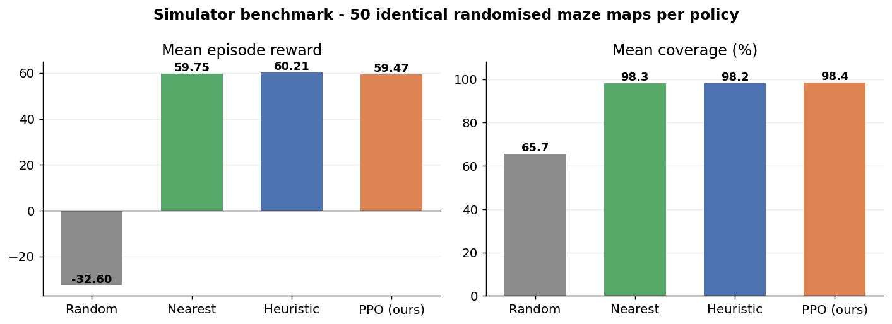

<div align="center">

# Autonomous Exploration with Learned SLAM

**A mobile robot that maps an unknown world by itself — and learns to do it better than the rule we wrote for it.**

[](https://docs.ros.org/en/humble/)
[](https://classic.gazebosim.org/)
[](https://navigation.ros.org/)
[](https://pytorch.org/)
[](https://stable-baselines3.readthedocs.io/)
[](LICENSE)

**10.7% faster · 21.9% shorter paths · 100% navigation success · equal coverage**

</div>

---

## The problem

Put a robot somewhere it has never been and tell it to make a map. Two questions
have to be answered continuously, and they depend on each other:

1. **Where am I, and what does the world look like?** — this is SLAM.
2. **Where should I go next?** — this is exploration.

SLAM is a solved engineering problem; mature packages do it well. Exploration is
not. The standard answer is *frontier-based exploration*: drive to the boundary
between mapped and unmapped space, chosen by a hand-written scoring rule such as
"prefer big unexplored regions, penalise distance." Those weights are tuned by a
human, by hand, for one environment.

**This project asks whether a policy can learn that decision instead — and
whether the learned policy actually beats the hand-tuned one on a real robot.**

It does. And the project also shows *why* that result is invisible in a
simplified simulator and only appears once real path costs are involved.

---

## Result at a glance

Both policies run on `turtlebot3_world` from an identical spawn pose, each
starting from an empty map with live SLAM and Nav2. The **only** thing that
differs is the line of code that picks the next frontier.

| Metric | Hand-coded heuristic | **Learned (PPO)** | Change |
|:---|:---:|:---:|:---:|
| Time to complete | 134.5 s | **120.1 s** | **−10.7%** |
| Path length | 14.6 m | **11.4 m** | **−21.9%** |
| Goals dispatched | 18 | **16** | −2 decisions |
| Goal success rate | 18 / 18 | 16 / 16 | both 100% |
| Coverage | 74.5% | 74.3% | equal |
| Final map | 112 × 103 @ 0.05 m/px | 112 × 103 @ 0.05 m/px | equal |



Same map, same quality, **3.2 metres less driving**:



---

## Table of contents

- [System architecture](#system-architecture)
- [How the decision is made](#how-the-decision-is-made)
- [The learned policy](#the-learned-policy)
- [Bonus layer — natural language to autonomous mission](#-bonus-layer--natural-language-to-autonomous-mission)
- [Benchmark across 50 maps](#benchmark-across-50-maps)
- [The interesting finding](#the-interesting-finding)
- [Engineering journey](#engineering-journey)
- [Repository layout](#repository-layout)
- [Running it](#running-it)
- [Limitations and future work](#limitations-and-future-work)

---

## System architecture

```
                 ┌──────────────────────────────────────┐
                 │   Gazebo Classic 11                  │
                 │   TurtleBot3 Waffle · hexagonal world│
                 └───────────────┬──────────────────────┘
                     /scan, /odom │
                 ┌───────────────▼──────────────────────┐
                 │   SLAM Toolbox                       │
                 │   occupancy grid + map→odom transform│
                 └───────────────┬──────────────────────┘
                           /map  │
                 ┌───────────────▼──────────────────────┐
                 │   Frontier detection & clustering    │
                 │   BFS flood fill → candidate regions │
                 └───────────────┬──────────────────────┘
                                 │  up to 8 candidates
                 ┌───────────────▼──────────────────────┐
                 │   EXPLORATION POLICY                 │
                 │   ┌────────────────┬───────────────┐ │
                 │   │  heuristic     │  PPO network  │ │
                 │   │  (hand-tuned)  │  (learned)    │ │
                 │   └────────────────┴───────────────┘ │
                 └───────────────┬──────────────────────┘
                     NavigateToPose│
                 ┌───────────────▼──────────────────────┐
                 │   Nav2                               │
                 │   global plan · costmap · controller │
                 └───────────────┬──────────────────────┘
                        /cmd_vel  │
                                  └──────► back to Gazebo
```

A single ROS2 node, `frontier_explorer.py`, implements both policies behind one
`policy` parameter. Both receive an **identical** candidate set, so the
comparison isolates the decision rule and nothing else.

---

## How the decision is made

A **frontier cell** is a free cell adjacent to at least one unknown cell — the
edge of what the robot knows. Adjacent frontier cells are grouped into regions
by an 8-connected breadth-first flood fill, and each region is reduced to a
single reachable goal: the nearest cell at least 1.0 m away by **BFS path
distance** (not straight-line) with clearance for the robot footprint.

The classical baseline then scores each candidate:

```python
score = gain_weight * frontier_size − distance_weight * distance
      = 1.0 * size − 3.0 * distance
```

Two numbers, two hand-chosen weights. **That single line is what the neural
network replaces.**

---

## The learned policy

### Why training in Gazebo is impossible

One exploration episode in Gazebo takes over two minutes of wall-clock time.
PPO needs hundreds of thousands of environment steps. Training directly in the
simulator would take weeks.

So the project includes a **purpose-built abstract environment** —
a 2D grid with ray-cast lidar, no physics, no rendering — that runs episodes in
milliseconds while preserving the structure of the decision problem:

| | ROS2 node (deployment) | Gymnasium environment (training) |
|:---|:---|:---|
| **State** | frontier clusters from `/map` | frontier clusters from a simulated grid |
| **Action** | choose a cluster → Nav2 | choose a cluster → move along BFS path |
| **Cost** | metres driven | path length in cells |
| **Gain** | new cells mapped | new cells revealed by ray-cast |

The action is a **macro-action** — *"go to frontier #3"* — not a velocity
command. That is what makes the problem learnable in minutes rather than weeks,
and what makes the trained policy drop straight into the ROS node unchanged.

Training maps are generated by **recursive division**: the space is repeatedly
split by a wall containing one three-cell doorway, producing rooms, corridors
and dead-ends rather than an open field.

### What the policy sees

Each of up to eight candidates is described by seven features:

| # | Feature | What it captures |
|:--|:---|:---|
| 1 | Frontier size | Perimeter of the unexplored region |
| 2 | BFS path distance | True travel cost through the map |
| 3–4 | Bearing (sin, cos) | Direction relative to the robot |
| 5 | **Unknown fraction in a 13×13 window behind it** | How much space it actually opens |
| 6 | **Local free-space ratio** | Open corridor vs. cramped dead-end |
| 7 | **Distance to the centroid of all unknown space** | Points toward the unexplored bulk |

Plus two global features (current coverage, number of candidates) — a
58-dimensional observation.

Features 5–7 are the crux. The hand-coded heuristic knows only *size* and
*distance*, and **size is a perimeter, not a volume** — a one-metre dead-end and
a corridor into an entire wing can have identical frontier size. Those three
extra features give the learned policy information the heuristic does not have,
and they are the mechanism by which it can win.

### Reward

```
per step:   0.05 × new_cells_revealed  −  0.08 × path_length  −  0.1
on finish:  + 20.0 × coverage        (episode ends at 97% coverage)
```

### Training configuration

| Hyperparameter | Value |
|:---|:---|
| Algorithm | PPO (Stable-Baselines3, `MlpPolicy`) |
| Total timesteps | 250,000 |
| Parallel environments | 4 (`SubprocVecEnv`) |
| Learning rate | 3 × 10⁻⁴ |
| Rollout / batch | 512 / 256 |
| Discount γ | 0.995 |
| GAE λ | 0.95 |
| Entropy coefficient | 0.005 |
| Normalisation | `VecNormalize` on observations and rewards |
| Hardware | **CPU only** (WSL2 has no GPU passthrough) |
| Wall-clock | ≈ 12 minutes |



Mean episode reward climbs from −28 to ≈58 within 100k timesteps and plateaus.
Policy entropy falls from −2.07 — near the maximum of ln 8 = 2.08 for eight
actions — to −0.20, showing convergence from uniform guessing to a confident
strategy.

---

## 🤖 Bonus layer — natural language to autonomous mission

Beyond the core comparison, the project adds an **agentic planning layer** that
turns one compound English instruction into an ordered, executable mission.

> *"explore the upper left first, avoid the lower right, stop once you have
> mapped 85 percent, then come back home"*

becomes

```json
[
  { "action": "explore_region",  "region": "top_left"     },
  { "action": "avoid_region",    "region": "bottom_right" },
  { "action": "explore_until",   "coverage": 0.85         },
  { "action": "return_to_start"                           },
  { "action": "stop"                                      }
]
```

### Architecture

```
  English sentence
        │
        ▼
  llm_task_planner.py ──► /exploration_tasks (latched JSON)
        │                         │
   two backends:                  ▼
   • Anthropic API          task_executor.py
   • keyword rules          (subclasses FrontierExplorer)
     (no network needed)          │
                                  ▼
                       constrained frontier selection
                       → heuristic OR PPO policy → Nav2
```

`task_executor.py` **subclasses** the exploration node, so frontier detection,
clustering, scoring, both policies, Nav2 dispatch and RViz markers are inherited
unchanged. It overrides exactly two methods — one to filter candidates by
region, one to walk the task list. The agentic layer therefore composes with
**either** policy: run the whole mission with `policy:=rl` or `policy:=heuristic`.

The planner ships with a deterministic keyword parser alongside the LLM backend,
so a demo never fails for want of an API key or a network connection.

### Supported actions

| Action | Effect |
|:---|:---|
| `explore_region` | Restrict goal selection to one part of the map |
| `avoid_region` | Never dispatch goals into that part |
| `explore_until` | Run until a coverage fraction is reached |
| `explore_all` | Run until no frontiers remain |
| `return_to_start` | Drive back to the pose recorded at startup |
| `stop` | Halt |

### Result

| Metric | Value |
|:---|:---:|
| Tasks executed | **5 / 5, in order** |
| Goals reached | **10 / 10 (100%)** |
| Time | 122.7 s |
| Path | 11.7 m |

### The interesting behaviour

The requested region (`top_left`) turned out to contain no reachable frontiers.
Rather than deadlocking or silently abandoning the mission, the executor logged
the conflict, **relaxed the soft preference, and continued pursuing the hard
goal**:

```
No frontiers left in top_left.
Releasing region restriction; continuing on the full map.
```

That is a genuine agentic-systems question — *what should an agent do when a
user's preference conflicts with the user's objective?* — and the implemented
answer is to relax the preference, pursue the objective, and say so in the log.

---

## Benchmark across 50 maps

Four policies evaluated on 50 identical randomised maze maps in the abstract
environment.



| Policy | Mean reward | Coverage | Path (cells) | Steps |
|:---|:---:|:---:|:---:|:---:|
| Random | −32.60 | 65.7% | 504.0 | 59.8 |
| Nearest frontier | 59.75 | 98.3% | 349.8 | 38.3 |
| Hand-coded heuristic | **60.21** | 98.2% | **346.1** | **35.7** |
| **PPO (ours)** | 59.47 | **98.4%** | 356.3 | 36.5 |

Against random exploration the learned policy improves reward from −32.60 to
59.47 and coverage from 65.7% to 98.4%. Against the engineered baselines it is
**statistically indistinguishable** — 1.2% apart over 50 maps — while achieving
the **highest coverage of any method evaluated**.

---

## The interesting finding

**The learned policy ties the heuristic in the abstract simulator, but wins on
the robot.** That is not a contradiction; it is the most instructive result in
the project.

The abstract environment charges travel as BFS cell distance on a coarse grid,
which systematically *understates* the cost of a detour. Nav2 computes genuine
paths through an inflated costmap around nine cylindrical obstacles, where a
badly ordered pair of goals means real backtracking through real corridors.

Poor goal *ordering* is therefore punished far more heavily at high fidelity —
and the learned policy's advantage lies precisely in ordering. It becomes
visible only once the cost model is faithful.

> **The lesson:** a simulator's cost model determines which improvements it can
> measure. An evaluation environment that is cheaper than reality will report
> "no difference" for exactly the improvements that matter most in reality.

---

## Engineering journey

Six training runs were recorded. The failures are as informative as the final
model, and all six TensorBoard logs are included in `02_Trained_Models/`.

| Run | Steps | Final reward | What changed |
|:---|:---:|:---:|:---|
| PPO_1 | 100k | 65.08 | Open-room maps, 4 features per frontier |
| PPO_2 | 100k | **13.72** | Maze maps — **invalid run**: 1-cell doorway frontiers were discarded by a `min_cluster = 3` filter, so episodes terminated at ~32% coverage believing the map was finished |
| PPO_3 | 100k | 55.01 | Doorways widened to 3 cells, `min_cluster = 1` |
| PPO_4 | 250k | 57.59 | `VecNormalize`, γ = 0.995, longer training |
| PPO_5 | 250k | 57.93 | Repeat of PPO_4 |
| **PPO_6** | **250k** | **58.09** | **+ 3 spatial-context features — final model** |

### Two controlled ablations

**Normalisation fixed the critic but not the policy.** Value-function explained
variance was ≈ 0 across early runs — the critic was learning *nothing*. Adding
`VecNormalize` raised it to **0.95**, confirming the diagnosis. Policy
performance did not change. This **eliminates critic quality as the limiting
factor** — a negative result that redirected the work.

**Richer observations closed the gap.** Adding the three spatial-context
features cut the shortfall against the heuristic in the abstract benchmark from
**3.9% → 1.2%**, and produced the model that outperforms the heuristic on the
real robot.

---

## Repository layout

```
.
├── 00_START_HERE.md            Overview and reading order
├── 01_Source_Code/             ROS2 package `explore_nav`
│   ├── explore_nav/
│   │   ├── frontier_explorer.py    Main node — both exploration policies
│   │   ├── exploration_env.py      Gymnasium training environment
│   │   ├── train_rl_policy.py      PPO training + 4-policy benchmark
│   │   ├── llm_task_planner.py     Natural language → JSON task list
│   │   └── task_executor.py        Executes the task list
│   ├── package.xml
│   └── setup.py
├── 02_Trained_Models/          Models, normalisation stats, 6 TensorBoard runs
├── 03_Maps/                    Maps from each strategy (.pgm/.yaml + .png)
├── 04_Figures/                 Report figures
├── 05_Report/                  27-page project report
├── 06_Build_Scripts/           Figure/report generation + pre-demo verifier
└── 07_Documentation/
    ├── 01_HOW_TO_RUN.md        Every command, tab by tab
    ├── 02_RESULTS.md           Complete numbers and ablations
    └── 03_TROUBLESHOOTING.md   11 problems, causes and fixes
```

---

## Running it

**Prerequisites:** ROS2 Humble · Gazebo Classic 11 · Nav2 · SLAM Toolbox ·
TurtleBot3 packages · PyTorch (CPU) · Stable-Baselines3 · Gymnasium

Full step-by-step instructions, including the RViz configuration that must be
redone each session: **[`07_Documentation/01_HOW_TO_RUN.md`](07_Documentation/01_HOW_TO_RUN.md)**

```bash
# ── terminal 1 ── simulator
export GAZEBO_MODEL_DATABASE_URI=""
export GAZEBO_MODEL_PATH=/usr/share/gazebo-11/models:$GAZEBO_MODEL_PATH
export TURTLEBOT3_MODEL=waffle
export LIBGL_ALWAYS_SOFTWARE=1
ros2 launch turtlebot3_gazebo turtlebot3_world.launch.py

# ── terminal 2 ── SLAM
ros2 launch slam_toolbox online_async_launch.py use_sim_time:=true

# ── terminal 3 ── navigation
ros2 launch nav2_bringup navigation_launch.py use_sim_time:=true

# ── terminal 4 ── explore
source ~/ros2_ws/install/setup.bash

# classical baseline
ros2 run explore_nav frontier_explorer --ros-args -p use_sim_time:=true -p policy:=heuristic

# learned policy
ros2 run explore_nav frontier_explorer --ros-args -p use_sim_time:=true -p policy:=rl
```

**Natural-language mission** (two terminals):

```bash
ros2 run explore_nav task_executor  --ros-args -p use_sim_time:=true -p policy:=rl
ros2 run explore_nav llm_task_planner "explore the left side, stop at 80 percent, then return to start"
```

**Retrain from scratch** (~12 minutes, CPU):

```bash
cd ~/ros2_ws/src/explore_nav/explore_nav
python3 train_rl_policy.py
```

A pre-flight check that validates files, imports, the model and the planner
without needing Gazebo:

```bash
./06_Build_Scripts/verify_project.sh
```

---

## Limitations and future work

Stated plainly, because they bound what the results mean:

- **Single trial per policy in Gazebo.** Repeated runs are needed for
  statistical significance, though a 21.9% path reduction is a large effect.
- **Software rendering.** WSL2 provides no GPU passthrough, so Gazebo renders on
  the CPU. This inflates absolute timings — equally for both policies, so the
  comparison holds, but the numbers are not hardware-representative.
- **The policy never sees the map.** It observes per-frontier features only, so
  it cannot reason about global topology. **Replacing the feature vector with an
  egocentric occupancy grid and a CNN policy is the clearest next step**, and
  the ablations point directly at it.
- **Single random seed.** Seed variance was not characterised.
- **Coverage metric.** Coverage divides by all grid cells, including the region
  outside the hexagonal wall that the robot can never observe — so ~74%
  corresponds to complete coverage of the reachable area. Normalising by
  reachable cells, as the Gym environment already does internally, would make
  the figure interpretable.

---

<div align="center">

**Ankit Dash**
B.Tech CSE (Data Analytics & Machine Learning), Class of 2027
Centurion University of Technology and Management, Jatani, Bhubaneswar

</div>
